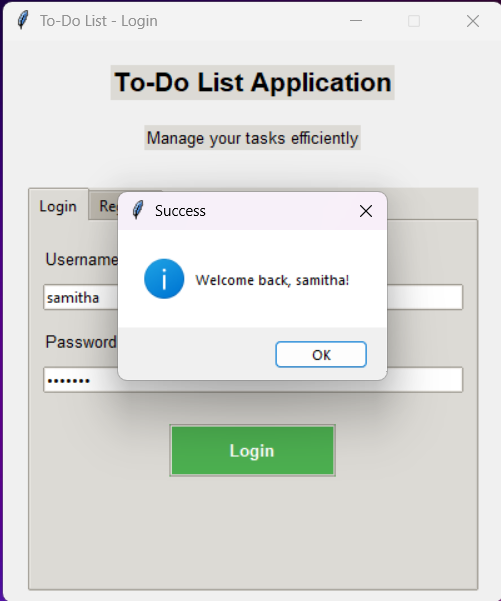
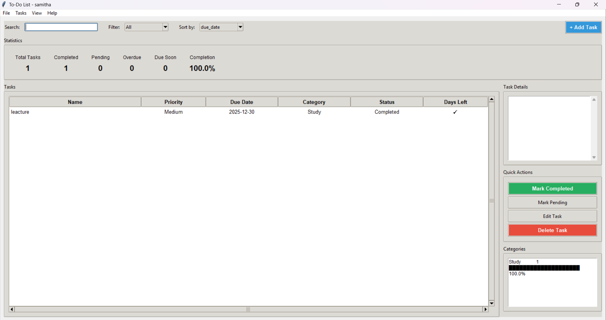

# 📋 Python To-Do List Application

A simple, fully functional To-Do List application built with Python and Tkinter.

## ✨ Features

- ✅ User registration and login
- ✅ Add tasks with priority and category
- ✅ Mark tasks as completed
- ✅ Delete tasks
- ✅ View task statistics
- ✅ Data persistence (saves to JSON files)
- ✅ Clean, user-friendly interface

## Screenshots

### Login Page


### Dashboard


### Add New task


## 🚀 Installation & Running

1. **Make sure you have Python installed** (Python 3.6 or higher)
   - Download from: https://www.python.org/downloads/

2. **Save the files:**
   - Save `main.py` to your project folder
   - Optionally create `requirements.txt` and `README.md`

3. **Run the application:**
   ```bash
   python main.py